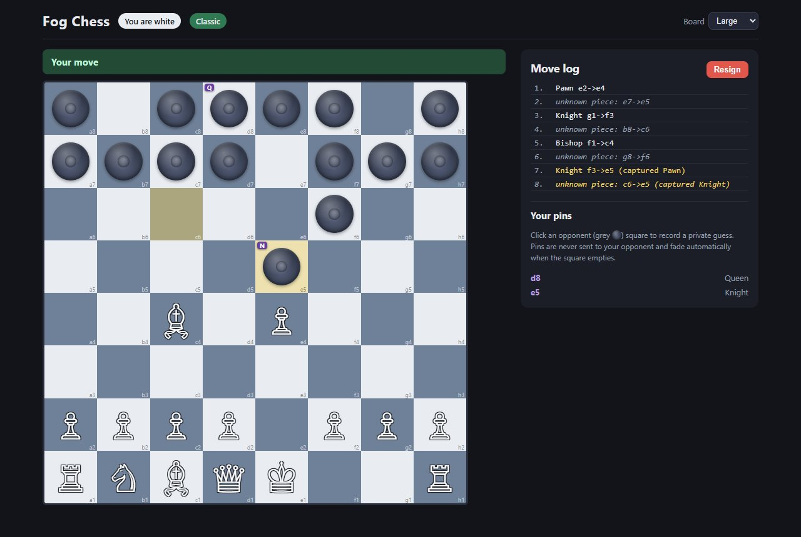
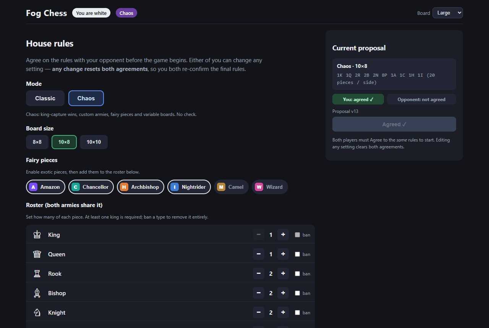
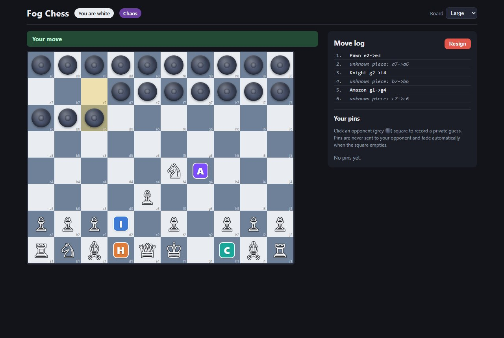

# Fog Chess

**Real-time, hidden-information chess for two players on the same Wi-Fi. You can see where your opponent's pieces are, but not what they are.**

Before the game, each player secretly arranges their own army. During the game, every enemy piece shows up as the same grey token. The server knows the full board and enforces the rules. Each player only ever receives a filtered view of it.



| Chaos mode: negotiating house rules | Chaos mode: 10×8 board with fairy pieces |
|---|---|
|  |  |

Fog Chess is close to the classic hidden-information variant **Kriegspiel**, with two twists:

1. **Secret setup.** Before the game, you arrange your own home ranks in any order.
2. **Private pins.** You can put private guess markers on your opponent's squares to keep track of what you think each hidden piece is. Your opponent never sees them.

---

## Status: work in progress

The game works end to end on a LAN. It is still a personal project, and a few things are unfinished.

**What works today**
- Two players connect and negotiate house rules, then each arranges their pieces in secret and plays a full game with a result screen and a full reveal at the end.
- **Classic mode** uses the standard chess rules through `chess.js`: legal moves, check, checkmate, stalemate, draws, en passant and promotion. Castling is disabled on purpose because the starting positions are custom.
- **Chaos mode** has its own rules engine: custom armies, piece bans, 6 fairy pieces, 8×8 / 10×8 / 10×10 boards, and the game is won by capturing the enemy king.
- The fog filter is enforced on the server: an opponent's piece type is never sent to your browser while the game is running.
- Resign, rematch (both players go back to the house-rules screen and keep their colours), and a board-size setting that is saved in your browser.

**Known limitations / what's next**
- **One match per server.** There are no rooms, room codes or spectators.
- **No reconnect.** If a player disconnects during a game, the game ends. Once both players have left, the server resets to a fresh lobby.
- **No clocks or timers.** Chaos mode has no move-limit or repetition draw rule. A game there ends only when a king is captured or the player to move has no legal move.
- **No automated test suite in the repo yet.** The backend and the fog filter were tested with throwaway socket-client scripts (an automated audit checked every board sent in every message across full games and found no leaks of hidden piece types). That process is written up in [`docs/transcripts/`](docs/transcripts/), but the scripts themselves are not committed.
- It only runs on a LAN or on localhost, and state is kept in memory with no database or accounts.

---

## Features

- **Real-time two-player play** over WebSockets (Socket.io).
- **House-rules negotiation.** Either player can propose the mode, board size, piece counts, bans and fairy pieces. Any change resets both agreements, and the game starts only when both players agree to the same proposal.
- **Secret arrangement phase.** You place your pieces anywhere on your own home ranks, including pawns on the back rank. You can click to place or drag and drop. Classic mode has a "Standard setup" shortcut and Chaos mode has "Auto-fill".
- **Fog of war.** Opponent pieces are drawn as a neutral hidden token, and their real type is never sent to you.
- **Capture reveals.** When a piece is captured, its type is revealed to both players. The piece that made the capture stays hidden. This is configurable.
- **Fair check (Classic).** You are told when you are in check, and the checking piece's *square* is highlighted, but not its identity.
- **Private pins.** Click any occupied opponent square to record a guess (Pawn/Knight/…/King or free text). Pins stay in your browser, and a pin fades automatically when its square empties.
- **Anonymized move log.** Your own moves are named in full (`Knight g1->f3`). Your opponent's moves show only the squares (`unknown piece: b8->c6`).
- **Full reveal** of both armies when the game ends.
- **Adjustable board size** (Small / Normal / Large / Huge), saved in `localStorage`.
- **No build step, no database, no accounts:** `npm install && npm start`.

### Chaos mode

A "go wild" mode that both players must agree to. Instead of checkmate, **you win by capturing every enemy king**:

- **Custom piece counts:** multiple queens, multiple kings, extra knights, and so on (at least one king is required).
- **Piece bans:** a banned type is removed from both armies.
- **Fairy pieces** (6):

  | Piece | Letter | Moves like |
  |-------|:-----:|-----------|
  | **Amazon** | A | Queen **+** Knight |
  | **Chancellor** | C | Rook **+** Knight |
  | **Archbishop** | H | Bishop **+** Knight |
  | **Nightrider** | I | A knight that keeps riding in the same knight direction |
  | **Camel** | M | A (1,3) leaper |
  | **Wizard** | W | Camel **+** one-step diagonal |

- **Bigger boards:** 8×8, 10×8 or 10×10.
- There is no check, so there is no checkmate. If the player to move has no legal move, the game is a draw.

Your own fairy pieces appear as coloured lettered badges. All of your opponent's pieces, standard or fairy, appear as the same hidden token.

---

## How it works: the server-side fog filter

The central design rule:

> **The rules engine uses standard, full-information rules. The fog is only a view filter applied when state is sent to each client. It never changes the rules.**

```
            full board (server memory only)
                         │
      ┌──────────────────┴──────────────────┐
      │ Classic: chess.js    Chaos: chaos.js│   legality, check, win/draw
      └──────────────────┬──────────────────┘
                         │
                  src/fog.js filterBoard(board, viewer)
                ┌────────┴────────┐
         White's view        Black's view
   own: {type,color}      own: {type,color}
   opp: {occupied:true}   opp: {occupied:true}
   empty: null            empty: null
```

- The **server** always holds the true board. Classic mode uses a `chess.js` instance, loaded from a FEN built from the two secret arrangements (`src/fen.js`). Chaos mode uses its own engine (`src/chaos.js`).
- Before **every** emit, `src/fog.js` turns the true board into a per-player copy. You get your own pieces in full, only `{occupied: true}` for opponent squares, and `null` for empty ones. Move-log entries are filtered the same way.
- `fog.js` works against a small "board source" interface (`get(square)`), so the same filter covers both modes and every board size without knowing any chaos rules.
- The full, unfiltered board is sent in exactly **one** place: the `gameOver` event, for the final reveal.
- The client (`public/client.js`) has no code path that draws an opponent piece type from the live board. The information simply isn't there.

The Socket.io events and payload shapes are specified in [`docs/CONTRACT.md`](docs/CONTRACT.md) and [`docs/CONTRACT-v2.md`](docs/CONTRACT-v2.md).

---

## Quick start

**Requirements:** [Node.js](https://nodejs.org/) 18 or newer, and a modern browser.

```bash
git clone https://github.com/naniiic137/fog-chess.git
cd fog-chess
npm install
npm start
```

The server prints its addresses:

```
Fog Chess running at:
  http://localhost:3000
  http://192.168.1.42:3000
```

- On the host, open `http://localhost:3000`.
- On a second device on the **same Wi-Fi**, open the `http://192.168.x.x:3000` address.
- To try it alone, open two browser windows. One of them should be private or incognito, or in a different browser.

The first two connections become **White** and **Black**. A third connection is told the match is full.

### Changing the port

```bash
# macOS / Linux / Git Bash
PORT=4000 npm start

# Windows PowerShell
$env:PORT=4000; npm start

# Windows CMD
set PORT=4000 && npm start
```

---

## How to play

1. **Lobby.** Wait for the second player to connect.
2. **House rules.** Pick **Classic** or **Chaos**. For Chaos, also set the board size, piece counts, bans and fairy pieces. Both players press **Agree** on the same proposal.
3. **Setup (secret).** You only see your own home ranks. Click a tray piece to pick it up, then click home squares to place it (dragging works too). Click a placed piece to remove it. Press **Ready** once every piece is placed.
4. **Play.** Click one of your pieces to see its legal moves, then click a highlighted square. Opponent moves flash their from/to squares. If a pawn reaches the last rank, you choose what it promotes to.
5. **Pins.** Click any occupied opponent square to save a private guess.
6. **End.** On checkmate, king capture, stalemate, draw, resignation or disconnect, both armies are revealed. **Rematch** (both players must accept) takes you back to the house-rules screen with the same colours.

---

## Configuration

| Where | Option | Default | Effect |
|---|---|---|---|
| `server.js` (`CONFIG`) | `revealCapturedPieceType` | `true` | Reveal a captured piece's type to both players. Set it to `false` for a harder, fully blind game. |
| Environment | `PORT` | `3000` | TCP port the server listens on. |
| Browser | Board size | Normal | Small / Normal / Large / Huge, saved in `localStorage`. |

---

## Project structure

```
fog-chess/
├── server.js            # Express static server + Socket.io event wiring; prints LAN URLs
├── package.json
├── src/
│   ├── game.js          # Match state machine: lobby → config → setup → playing → ended; routes by mode
│   ├── fog.js           # The fog filter: the only module that handles hidden information
│   ├── fen.js           # Validates classic arrangements and builds the starting FEN for chess.js
│   └── chaos.js         # Chaos rules engine: fairy pieces, variable boards, king capture
├── public/              # Static frontend (no framework, no bundler)
│   ├── index.html       # Markup for every screen (lobby / house rules / setup / game / end) + modals
│   ├── style.css
│   └── client.js        # Rendering, setup, moves, pins, socket wiring
└── docs/
    ├── screenshots/
    ├── PLAN.md, PLAN-v2.md             # Implementation plans (v1 classic, v2 chaos mode)
    ├── CONTRACT.md, CONTRACT-v2.md     # Socket.io event contract (payload shapes)
    ├── fog-chess-build-prompt.md       # Original project brief
    └── transcripts/                    # Build and test logs, including the fog-leak audit
```

---

## Tech stack

- **Node.js**, **Express** (static hosting), **Socket.io** (real-time transport)
- **chess.js** for Classic-mode rules, with a hand-written engine for Chaos mode
- Plain **HTML / CSS / JavaScript** frontend with no framework and no build step

---

## Troubleshooting

**The second device can't reach the page, or it stays on "Connecting…".**
This is almost always the host's firewall.
- **Windows:** the first time you run the server, allow Node.js in the Windows Defender Firewall prompt with **Private networks** checked. If you dismissed the prompt, go to *Windows Security → Firewall & network protection → Allow an app through firewall*.
- **macOS:** *System Settings → Network → Firewall*, then allow incoming connections for Node.
- Make sure both devices are on the **same** network (not a guest network and not cellular).

**`EADDRINUSE` (port already in use).** Start the server on another port, for example `PORT=4000 npm start`.

**"Match is full."** Two players are already connected. Close one of the other tabs or devices and reload.

**A player disconnected mid-game.** Reconnecting isn't supported yet. Refresh both browsers to start a new match.

---

## Rules notes

- **No castling**, in either mode, because the starting positions are custom.
- **Back-rank pawns** are allowed. They move one square at a time until they reach their 2nd rank.
- **Promotion** works as normal. In Chaos mode the choices come from the agreed roster. If no choice is sent, the pawn promotes to a queen (when a queen is available).

## License

© 2026 Hamza Ben Ismail. All rights reserved.
